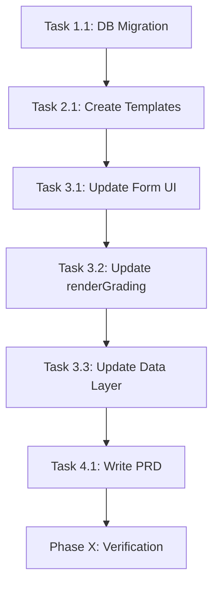

# Kế hoạch: Triển khai Mẫu Chấm Điểm theo Loại Nhân Viên

> **Date**: 2026-01-31  
> **Status**: PLANNING  
> **Project Type**: WEB (React + Supabase)

---

## 📋 Overview

### Mục tiêu
Triển khai hệ thống chấm điểm KPI với **3 mẫu riêng biệt** dựa trên loại nhân viên:
- **NVTT** - Nhân viên trực tiếp
- **NVGT** - Nhân viên gián tiếp  
- **CBQL** - Cán bộ quản lý

### Kiến trúc đề xuất
Tách thành 2 trường riêng biệt để tránh conflict logic:

| Trường | Mục đích | Giá trị |
|--------|----------|---------|
| `employment_type_code` | Phục vụ HR (loại nhân sự) | `NVCT`, `NVTV`, `NVGT`, `NVTT`, `CBQL` |
| `score_template_code` | Phục vụ Chấm điểm | `NVTT`, `NVGT`, `CBQL` |

### Mapping Logic
```
employment_type_code → score_template_code (default)
─────────────────────────────────────────────────
NVCT (Nhân viên chính thức) → NVTT (default, có thể override)
NVTV (Nhân viên thời vụ)    → NVTT (default, có thể override)
NVGT (Nhân viên gián tiếp)  → NVGT
NVTT (Nhân viên trực tiếp)  → NVTT
CBQL (Cán bộ quản lý)       → CBQL
```

---

## ✅ Success Criteria

- [ ] Dropdown "Loại nhân viên" với 5 options đầy đủ
- [ ] Dropdown "Mẫu chấm điểm" với 3 options (NVTT/NVGT/CBQL)
- [ ] Auto-suggest mẫu chấm điểm dựa trên loại nhân viên
- [ ] Mỗi mẫu chấm điểm hiển thị đúng bảng tiêu chí tương ứng
- [ ] Dữ liệu chấm điểm lưu đúng theo `score_template_code`
- [ ] PRD được cập nhật

---

## 🛠️ Tech Stack

| Layer | Technology |
|-------|------------|
| Frontend | React + Vite |
| Backend | Supabase (PostgreSQL) |
| State | React useState |
| Styling | CSS (EmployeeDetail.css) |

---

## 📁 File Structure (Affected Files)

```
supabase/
├── migrations/
│   ├── 20260131_add_score_template_code.sql [NEW]   # Add new column
│   └── 20260127_create_employee_profiles.sql        # Reference
│
src/
├── components/
│   ├── EmployeeDetail.jsx                           [MODIFY] # Main changes
│   └── EmployeeDetail.css                           [MODIFY] # Styling if needed
├── data/
│   └── gradingTemplates.js                          [NEW]    # 3 CRITERIA templates
│
docs/
├── PLAN-employee-grading-templates.md               [NEW]    # This file
└── PRD-employee-grading.md                          [NEW]    # PRD document
```

---

## 📝 Task Breakdown

### Phase 1: Database Schema Update

#### Task 1.1: Add `score_template_code` column
- **Agent**: `backend-specialist`
- **Priority**: P0
- **Dependencies**: None

**INPUT**: Current `employee_profiles` table with `employee_type` field  
**OUTPUT**: New column `score_template_code` added with CHECK constraint  
**VERIFY**: 
```sql
SELECT column_name, data_type 
FROM information_schema.columns 
WHERE table_name = 'employee_profiles' AND column_name = 'score_template_code';
```

**Migration SQL**:
```sql
-- Add score_template_code column
ALTER TABLE public.employee_profiles
ADD COLUMN score_template_code TEXT 
CHECK (score_template_code IN ('NVTT', 'NVGT', 'CBQL'));

-- Set default values based on existing employee_type
UPDATE public.employee_profiles SET score_template_code = 
  CASE 
    WHEN employee_type IN ('MB NVCT', 'NVTV', 'NVTT') THEN 'NVTT'
    WHEN employee_type = 'NVGT' THEN 'NVGT'
    WHEN employee_type = 'CBQL' THEN 'CBQL'
    ELSE 'NVTT'
  END;

-- Add comment
COMMENT ON COLUMN public.employee_profiles.score_template_code 
IS 'Mẫu chấm điểm KPI: NVTT (Trực tiếp), NVGT (Gián tiếp), CBQL (Quản lý)';
```

---

### Phase 2: Create Grading Templates

#### Task 2.1: Define 3 CRITERIA templates
- **Agent**: `frontend-specialist`
- **Priority**: P1
- **Dependencies**: Task 1.1

**INPUT**: Existing `CRITERIA` constant in `EmployeeDetail.jsx`  
**OUTPUT**: New file `src/data/gradingTemplates.js` with 3 template objects  
**VERIFY**: Import works, each template has correct sections A/B/C

**File**: `src/data/gradingTemplates.js`
```javascript
// Template cho Nhân viên trực tiếp (NVTT)
export const CRITERIA_NVTT = [
  {
    section: 'A',
    title: 'KHUNG ĐIỂM TRỪ [A = 20 - 1.1 - 1.2 - 1.3]',
    maxScore: 20,
    isDeduction: true,
    items: [
      { id: '1', title: 'Chấp hành Nội quy lao động', maxScore: 20, isHeader: true },
      { id: '1.1', title: 'Nhóm hành vi Điều 23 - Nội quy lao động', range: '1 - 9' },
      { id: '1.2', title: 'Nhóm hành vi Điều 24 - Nội quy lao động', range: '10 - 15' },
      { id: '1.3', title: 'Nhóm hành vi Điều 25, Điều 26 - Nội quy lao động', range: '16 - 20' },
    ]
  },
  // ... Section B, C (giống CRITERIA hiện tại hoặc tuỳ chỉnh)
];

// Template cho Nhân viên gián tiếp (NVGT)
export const CRITERIA_NVGT = [
  // ... Có thể khác NVTT về tiêu chí đánh giá
];

// Template cho Cán bộ quản lý (CBQL) 
export const CRITERIA_CBQL = [
  // ... Thêm tiêu chí quản lý, lãnh đạo
];

// Mapping function
export const getGradingTemplate = (scoreTemplateCode) => {
  const templates = {
    'NVTT': CRITERIA_NVTT,
    'NVGT': CRITERIA_NVGT,
    'CBQL': CRITERIA_CBQL
  };
  return templates[scoreTemplateCode] || CRITERIA_NVTT;
};
```

---

### Phase 3: Update UI Components

#### Task 3.1: Update EmployeeDetail.jsx - Form Fields
- **Agent**: `frontend-specialist`
- **Priority**: P1
- **Dependencies**: Task 1.1, Task 2.1

**INPUT**: Current `employee_type` dropdown  
**OUTPUT**: 
1. Updated dropdown với label rõ ràng
2. New dropdown `score_template_code`
3. Auto-suggest logic

**VERIFY**: Both dropdowns render correctly, auto-suggest works

**Changes**:
```jsx
// 1. Import templates
import { getGradingTemplate, CRITERIA_NVTT, CRITERIA_NVGT, CRITERIA_CBQL } from '../data/gradingTemplates';

// 2. Add state for score_template_code in formData
score_template_code: 'NVTT', // default

// 3. Update dropdown UI (in renderThongTinCongViec)
<div className="form-group">
    <label>Loại nhân viên (HR)</label>
    <select name="employee_type" value={formData.employee_type} onChange={handleEmployeeTypeChange} disabled={!isEditing}>
        <option value="MB NVCT">Nhân viên chính thức (NVCT)</option>
        <option value="NVGT">Nhân viên gián tiếp (NVGT)</option>
        <option value="NVTV">Nhân viên thời vụ (NVTV)</option>
        <option value="NVTT">Nhân viên trực tiếp (NVTT)</option>
        <option value="CBQL">Cán bộ quản lý (CBQL)</option>
    </select>
</div>

<div className="form-group">
    <label>Mẫu chấm điểm</label>
    <select name="score_template_code" value={formData.score_template_code} onChange={handleChange} disabled={!isEditing}>
        <option value="NVTT">Trực tiếp (NVTT)</option>
        <option value="NVGT">Gián tiếp (NVGT)</option>
        <option value="CBQL">Quản lý (CBQL)</option>
    </select>
</div>

// 4. Auto-suggest handler
const handleEmployeeTypeChange = (e) => {
    const newType = e.target.value;
    const suggestedTemplate = getSuggestedTemplate(newType);
    setFormData(prev => ({
        ...prev,
        employee_type: newType,
        score_template_code: suggestedTemplate
    }));
};

const getSuggestedTemplate = (employeeType) => {
    const map = {
        'MB NVCT': 'NVTT',
        'NVTV': 'NVTT',
        'NVTT': 'NVTT',
        'NVGT': 'NVGT',
        'CBQL': 'CBQL'
    };
    return map[employeeType] || 'NVTT';
};
```

#### Task 3.2: Update renderGrading() to use dynamic template
- **Agent**: `frontend-specialist`
- **Priority**: P1
- **Dependencies**: Task 3.1

**INPUT**: Current `renderGrading()` using static `CRITERIA`  
**OUTPUT**: Dynamic template based on `formData.score_template_code`

**VERIFY**: Grading table shows correct criteria for each template

**Changes**:
```jsx
const renderGrading = () => {
    // Get template based on employee's score_template_code
    const currentCriteria = getGradingTemplate(formData.score_template_code);
    
    // ... rest of render logic using currentCriteria instead of CRITERIA
};
```

#### Task 3.3: Update data fetching and saving
- **Agent**: `frontend-specialist`
- **Priority**: P1
- **Dependencies**: Task 3.2

**INPUT**: Current fetch/save logic  
**OUTPUT**: Include `score_template_code` in all DB operations

**VERIFY**: Data persists correctly after save/reload

---

### Phase 4: Create PRD Document

#### Task 4.1: Write PRD-employee-grading.md
- **Agent**: `project-planner`
- **Priority**: P2
- **Dependencies**: All Phase 3 tasks

**INPUT**: Requirements from this plan  
**OUTPUT**: Complete PRD document at `docs/PRD-employee-grading.md`

**VERIFY**: PRD contains all sections: Overview, Features, Data Model, UI Specs

---

### Phase X: Verification

- [ ] **Lint**: `npm run lint` passes
- [ ] **Build**: `npm run build` succeeds
- [ ] **Manual Test**:
  - [ ] Create employee with each `employee_type` → correct `score_template_code` suggested
  - [ ] View grading page → correct template displayed
  - [ ] Save grading → data persists correctly
  - [ ] Switch template → grading table updates
- [ ] **Rule Compliance**:
  - [ ] No purple/violet colors
  - [ ] Socratic Gate respected

---

## ⚠️ Risks & Mitigations

| Risk | Mitigation |
|------|------------|
| Existing grading data compatibility | Migration script sets default `score_template_code` based on `employee_type` |
| Different templates have different criterion IDs | Use template-specific JSONB structure, store template code with each review |
| User confusion about 2 dropdowns | Clear labels + auto-suggest behavior |

---

## 📊 Dependency Graph



---

## 🚀 Next Steps

1. Review this plan
2. Run `/create` to start implementation
3. Or modify plan manually
